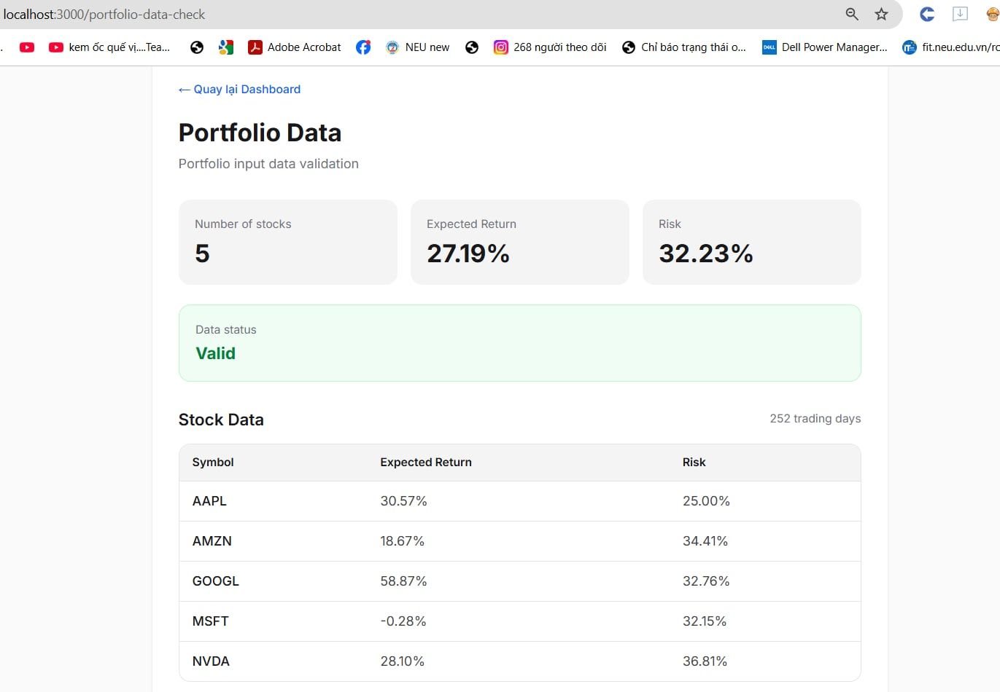

# NEXUS-DATA-003 – Portfolio Data Check

## 1. Thông tin

**Họ tên:** Nguyễn Hồng Sinh

**Nhóm:** 1

**Task:** SV03 – Portfolio Data Check

**Ngày thực hiện:** 11/09/2026

---

# 2. Chức năng này dùng để làm gì?

Portfolio Data Check dùng để kiểm tra và hiển thị dữ liệu đầu vào của danh mục đầu tư.

Chức năng gọi API `/api/v1/data-pipeline/portfolio-inputs` để lấy dữ liệu cổ phiếu, số ngày giao dịch, lợi nhuận kỳ vọng và độ biến động.

Sau khi nhận dữ liệu, frontend kiểm tra dữ liệu có hợp lệ hay không và hiển thị trạng thái `Valid` hoặc `Invalid`.

# 3. Nghiệp vụ

## 3.1 Người dùng muốn làm gì?

Người dùng muốn kiểm tra nhanh dữ liệu đầu vào của danh mục trước khi sử dụng cho các chức năng phân tích và tối ưu danh mục.

## 3.2 Tại sao Nexus cần chức năng này?

Chức năng giúp kiểm tra dữ liệu cổ phiếu có tồn tại và có đầy đủ thông tin cần thiết hay không trước khi thực hiện các bước xử lý tiếp theo.

## 3.3 Người dùng sử dụng như thế nào?

Người dùng truy cập trang Portfolio Data Check.

Hệ thống tự động gọi API để lấy dữ liệu danh mục và hiển thị:

- Number of stocks
- Expected Return
- Risk
- Data status
- Thông tin chi tiết từng cổ phiếu

# 4. API sử dụng

API:

`GET /api/v1/data-pipeline/portfolio-inputs`

API dùng để lấy dữ liệu giá đã được xử lý của các cổ phiếu trong danh mục, bao gồm:

- Danh sách mã cổ phiếu
- Số ngày giao dịch
- Expected Return
- Volatility
- Covariance Matrix
- Correlation Matrix

# 5. Input

Ví dụ input:

```text
symbols = AAPL, MSFT, NVDA, AMZN, GOOGL
days = 252
```
# 6. Output

Portfolio Data

Number of stocks: 5

Expected Return: 27.19%

Risk: 32.23%

Data status: Valid

Thông tin chi tiết gồm danh sách mã cổ phiếu, Expected Return và Risk của từng cổ phiếu.

---

# 7. Cách tôi thực hiện

1. Kiểm tra API `/api/v1/data-pipeline/portfolio-inputs`.
2. Kiểm tra response của API bằng Swagger.
3. Tạo component `PortfolioDataCheck.tsx`.
4. Kết nối frontend với API backend.
5. Xử lý trạng thái loading và error.
6. Kiểm tra dữ liệu cổ phiếu nhận được từ API.
7. Tính toán Expected Return và Risk để hiển thị.
8. Hiển thị trạng thái Valid hoặc Invalid.
9. Tạo route `/portfolio-data-check`.
10. Kiểm tra chức năng trên trình duyệt.

---

# 8. Code chính

Các file đã thay đổi:

`app/PortfolioDataCheck.tsx`

`app/portfolio-data-check/page.tsx`

---

# 9. Test

| STT | Test case | Expected | Actual | Result |
|---|---|---|---|---|
| 1 | Nhập AAPL, MSFT, NVDA, AMZN, GOOGL | Hiển thị dữ liệu hợp lệ | Hiển thị dữ liệu hợp lệ | PASS |
| 2 | Nhập AAPL, INVALID, NVDA, AMZN, GOOGL | Loại mã không hợp lệ | INVALID bị loại khỏi kết quả | PASS |
| 3 | Nhập INVALID | API trả về 404 | API trả về 404 | PASS |
| 4 | Nhập AAPL với days = 0 | API trả về 422 | API trả về 422 | PASS |

---

# 10. Screenshot


---
 
# 11. Khó khăn gặp phải

- API ban đầu gặp lỗi kết nối database.
- Phải kiểm tra và import dữ liệu vào PostgreSQL để API hoạt động.
- API response không có sẵn các trường tổng hợp Number of stocks, Expected Return và Risk nên frontend cần xử lý dữ liệu để hiển thị.
- Phải kiểm tra đúng frontend repository và đúng route khi chạy chức năng.

---

# 12. Tôi đã học được gì?

- Cách kết nối frontend Next.js với API backend.
- Cách xử lý dữ liệu JSON từ API.
- Cách xử lý trạng thái loading và error.
- Cách kiểm tra dữ liệu hợp lệ và không hợp lệ.
- Cách tạo route cho chức năng trong Next.js.
- Cách sử dụng Git branch, commit và Merge Request.

---

# 13. Git

Branch:

feature/NEXUS-DATA-003-portfolio-data-check

Commit:

9e4b0ce docs: add portfolio data check documentation

Merge Request:

https://github.com/NicolasWillyam/nexus-fe/pull/9