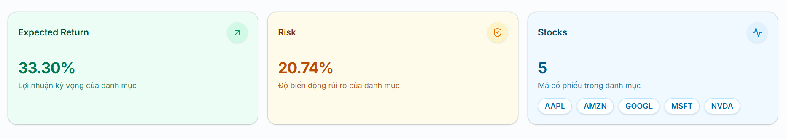

# NEXUS-PORT–004

## 1. Thông tin

Họ tên: Nguyễn Thị Như Ngọc

Nhóm: 3 (Scoring & Portfolio)

Task: Portfolio Summary

# 2. Chức năng này dùng để làm gì?

Chức năng này dùng để hiển thị nhanh thông tin tổng quan
của danh mục đầu tư sau khi hệ thống có dữ liệu phân bổ danh mục.

Chức năng hiển thị 3 thông tin chính:

- Expected Return: lợi nhuận kỳ vọng của danh mục.
- Risk: mức độ rủi ro/độ biến động của danh mục.
- Stocks: số lượng và mã các cổ phiếu trong danh mục.

Mục đích là giúp người dùng nhanh chóng nắm được đặc điểm chính
của danh mục mà không cần xem chi tiết từng cổ phiếu hoặc bảng phân bổ

# 3. Nghiệp vụ

## 3.1 Người dùng muốn làm gì?

Người dùng muốn xem nhanh các thông tin tổng quan của danh mục đầu tư,
bao gồm lợi nhuận kỳ vọng, mức độ rủi ro và các mã cổ phiếu đang được
sử dụng trong danh mục

## 3.2 Tại sao Nexus cần chức năng này?

Chức năng này giúp người dùng có cái nhìn tổng quan về danh mục đầu tư
trước khi xem các thông tin chi tiết hơn.

Thay vì phải xem nhiều dữ liệu riêng lẻ, người dùng có thể nhanh chóng
biết:

- Danh mục có bao nhiêu cổ phiếu.
- Danh mục có mức lợi nhuận kỳ vọng bao nhiêu.
- Danh mục có mức rủi ro bao nhiêu.
- Những mã cổ phiếu nào đang được sử dụng.

## 3.3 Người dùng sử dụng như thế nào?

Thông tin được trình bày dưới dạng các Summary Card nên người dùng
có thể quan sát nhanh ngay trên Dashboard.

# 4. API sử dụng

### API 1

**GET /api/v1/data-pipeline/portfolio-inputs**

API dùng để lấy dữ liệu đầu vào phục vụ tính toán Portfolio,
bao gồm:

- Danh sách mã cổ phiếu.
- Số ngày giao dịch.
- Expected Return của từng cổ phiếu.
- Volatility của từng cổ phiếu.
- Covariance Matrix.

### API 2

**POST /api/v1/portfolio/portfolio/optimize**

API dùng để lấy kết quả phân bổ Portfolio,
bao gồm:

- Score của từng cổ phiếu.
- Tỷ trọng phân bổ (`weights_percent`).
- Số tiền phân bổ cho từng cổ phiếu.
- Tổng số tiền đầu tư.

# 5. Input

Portfolio Summary không yêu cầu người dùng nhập dữ liệu trực tiếp
trên giao diện.

# 6. Output

Expected Return
33.30%

Risk
20.74%

Stocks
5

[AAPL] [MSFT] [NVDA] [GOOGL] [AMZN]

Trong đó:

Expected Return: lợi nhuận kỳ vọng của toàn bộ danh mục.
Risk: độ biến động/rủi ro của toàn bộ danh mục.
Stocks: số lượng cổ phiếu trong danh mục.
Các mã cổ phiếu được hiển thị dưới dạng badge.

Các giá trị thực tế được lấy và tính toán dựa trên dữ liệu backend.

# 7. Cách tôi thực hiện

1. Xây dựng component PortfolioSummary.tsx.
2. Component nhận danh sách mã cổ phiếu từ Dashboard.
3. Khi component được render, sử dụng useEffect() để tự động
thực hiện việc lấy dữ liệu.
4. Gọi API: GET data-pipeline/portfolio-inputs
--> để lấy dữ liệu đầu vào của Portfolio.
5. Lấy danh sách mã cổ phiếu thực tế từ: portfolioResponse.data.symbols và lưu vào state portfolioSymbols.
6. Gọi API: POST portfolio/portfolio/optimize
--> để lấy tỷ trọng phân bổ của các cổ phiếu.
7. Tính Expected Return của toàn bộ Portfolio dựa trên Expected Return
của từng cổ phiếu và tỷ trọng phân bổ.
8. Tính Risk của Portfolio dựa trên tỷ trọng và Covariance Matrix.
9. Hiển thị kết quả trên 3 Summary Card.
10. Bổ sung Loading State trong thời gian API đang xử lý.
11. Bổ sung Error State khi không thể lấy dữ liệu từ API.

# 8. Code chính
File chính: components\ui\PortfolioSummary.tsx

Các thành phần chính:

PortfolioInputsResponse: kiểu dữ liệu Portfolio Inputs.
PortfolioOptimizeResponse: kiểu dữ liệu Portfolio Optimize.
portfolioSymbols: lưu danh sách mã cổ phiếu thực tế.
calculatePortfolioExpectedReturn(): tính Expected Return.
calculatePortfolioRisk(): tính Risk.
loadPortfolioSummary(): lấy và xử lý dữ liệu từ API.
Summary Cards: hiển thị Expected Return, Risk và Stocks.

# 9. Test

# 10. Screenshot

# 11. Khó khăn gặp phải

- Ban đầu em chia đều tỷ trong phân bổ các mã cổ phiếu nhưng thực tế phải dựa vào allocation để biết weights của từng mã rồi từ đó mới tính được expected return và risk
--> Vậy nên phải dựa vào cả api: POST portfolio/portfolio/optimize 
để biết được tỷ trọng phân bổ đã rồi mới tính 

# 12. Tôi đã học được gì?

- Hiểu cách xây dựng một React component có khả năng tự động lấy
dữ liệu từ backend khi trang được mở.
- Hiểu cách kết hợp dữ liệu từ Portfolio Inputs API và Portfolio
Optimize API.
- Hiểu cách tính Expected Return và Risk cho toàn bộ Portfolio.
- Biết cách xử lý Loading State và Error State trong frontend.
- Hiểu hơn về cách dữ liệu backend được chuyển thành các thông tin
tổng quan trên Dashboard.

# 13. Git

Branch:

feature/NEXUS-SV13-portfolio-summary

Commit:

feat: add portfolio summary

Merge Request:https://github.com/NicolasWillyam/nexus-fe/pull/11

