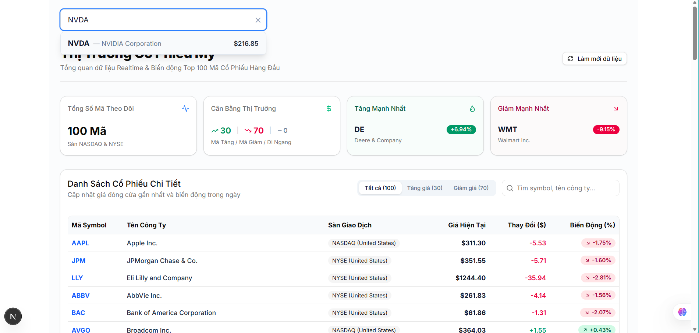
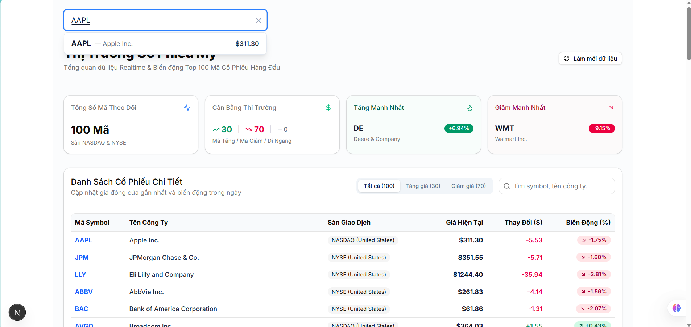
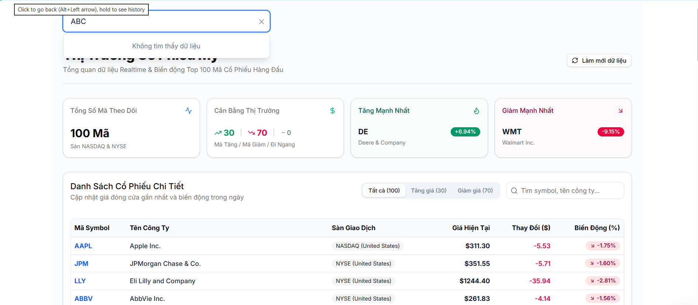
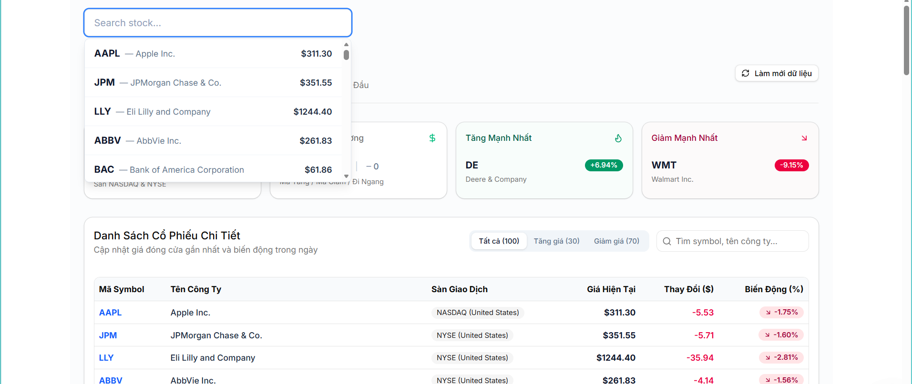

# NEXUS-STOCK-002 – Stock Search

## 1. Thông tin

**Họ tên:** Nguyễn Đức Mạnh

**Nhóm:** Nhóm 2

**Task:** NEXUS-STOCK-002 (Implement stock search)

**Ngày thực hiện:** 13/09/2026

---

# 2. Chức năng này dùng để làm gì?

Chức năng này cho phép người dùng tìm kiếm một cổ phiếu theo mã cổ phiếu (Ticker/Symbol).

---

# 3. Nghiệp vụ

## 3.1 Người dùng muốn làm gì?

Người dùng muốn nhập mã cổ phiếu vào ô tìm kiếm để lọc nhanh thông tin cổ phiếu tương ứng.

## 3.2 Tại sao Nexus cần chức năng này?

Chức năng này giúp người dùng tiết kiệm thời gian, dễ dàng định vị cổ phiếu cần theo dõi thay vì phải tìm thủ công trong danh sách dài.

## 3.3 Người dùng sử dụng như thế nào?

1. Người dùng mở Stock Analysis.
2. Nhập mã cổ phiếu vào ô search.
3. Hệ thống tìm kiếm theo mã cổ phiếu.
4. Hiển thị kết quả.

---

# 4. API sử dụng

API:
`GET /api/v1/stocks`

API dùng để lấy danh sách các mã cổ phiếu để thực hiện lọc dữ liệu ở phía giao diện (Client-side).

---

# 5. Input

Search keyword:
`NVDA`

---

# 6. Output

`NVDA`

---

# 7. Cách tôi thực hiện

1. Nhận danh sách cổ phiếu từ props hoặc gọi API lấy danh sách stock.
2. Lưu từ khóa người dùng nhập vào `searchTerm` state.
3. Chuyển từ khóa về dạng chữ thường (`toLowerCase()`).
4. Dùng `useMemo` lọc danh sách: Chỉ so sánh từ khóa với thuộc tính mã cổ phiếu (`symbol` / `ticker`).
5. Hiển thị kết quả khớp ra màn hình, nếu rỗng thì báo "Không tìm thấy dữ liệu".

---

# 8. Code chính

StockSearch.tsx

---

# 9. Test

| STT | Test case | Expected | Actual | Result |
|---|---|---|---|---|
| 1 | Nhập NVDA | Hiển thị NVDA | Hiển thị NVDA | PASS |
| 2 | Nhập AAPL | Hiển thị AAPL | Hiển thị AAPL | PASS |
| 3 | Nhập ABC | Không tìm thấy dữ liệu | Không tìm thấy dữ liệu | PASS |
| 4 | Search rỗng | Hiển thị tất cả cổ phiếu | Hiển thị tất cả cổ phiếu | PASS |

---

# 10. Screenshot

### Test 1: Nhập NVDA

### Test 2: Nhập AAPL

### Test 3: Nhập ABC (Không tìm thấy)

### Test 4: Search rỗng (Hiển thị tất cả cổ phiếu)

---

# 11. Khó khăn gặp phải

- Ban đầu logic tìm kiếm bị dính cả thuộc tính Tên công ty (`company_name`), dẫn đến việc khi gõ `"ABC"` thì hệ thống vẫn hiển thị công ty `"Babcock & Wilcox Enterprises, Inc."` do có chứa chuỗi `"abc"`.
- **Cách xử lý:** Đã điều chỉnh lại điều kiện lọc, bỏ so sánh với Tên công ty và chỉ lọc duy nhất dựa trên Mã cổ phiếu (`symbol` / `ticker`).
- Xác định phạm vi yêu cầu (Scope Creep):

- Ban đầu chưa làm rõ yêu cầu là chỉ tìm theo Mã cổ phiếu (Ticker) hay cả Tên công ty (Company Name), dẫn đến việc phải điều chỉnh lại scope bài toán cho đúng với thiết kế ban đầu.

- Xây dựng kịch bản kiểm thử (Edge Cases):

- Khó khăn trong việc lường trước các case tìm kiếm đặc biệt (như case nhập chuỗi "ABC" dễ bị ăn theo chuỗi con của tên công ty "Babcock"), đòi hỏi phải viết kịch bản test kỹ để phát hiện ra lỗi logic này.

- Đảm bảo tính chính xác giữa Yêu cầu (Expected) và Thực tế (Actual):

- Phải liên tục đối soát kết quả hiển thị trên giao diện với tập dữ liệu gốc để đảm bảo hệ thống phản hồi đúng và không bỏ sót case search rỗng.

---

# 12. Tôi đã học được gì?

- Đọc kỹ yêu cầu nghiệp vụ để chỉ lọc đúng trường dữ liệu bài toán yêu cầu.
- Hiểu rõ hơn cách dùng `useMemo` và thao tác xử lý chuỗi trong React.
- Học được cách làm rõ chi tiết yêu cầu (Requirement Clarification) ngay từ đầu để tránh mất thời gian điều chỉnh lại scope.
- Biết cách tạo kịch bản kiểm thử bao phủ được các trường hợp đúng, sai, rỗng và trường hợp biên (edge cases) thay vì chỉ test các trường hợp cơ bản.
- Nắm vững quy trình làm việc chuẩn gồm: Xác định yêu cầu --> Thiết kế Input/Output --> Kiểm thử nghiệm thu (UAT) --> Viết tài liệu bàn giao.
---

# 13. Git

Branch:
`feature/NEXUS-STOCK-002-stock-search`

Commit:
`feat: add stock search by ticker`

Merge Request:
`[NEXUS-STOCK-002] Implement stock search`