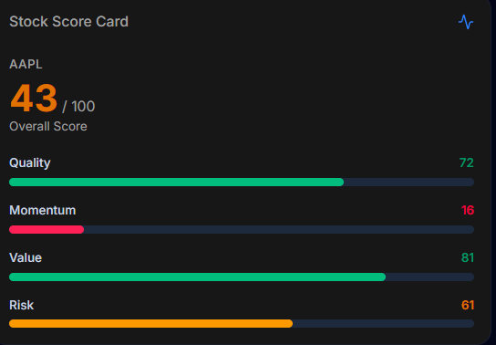
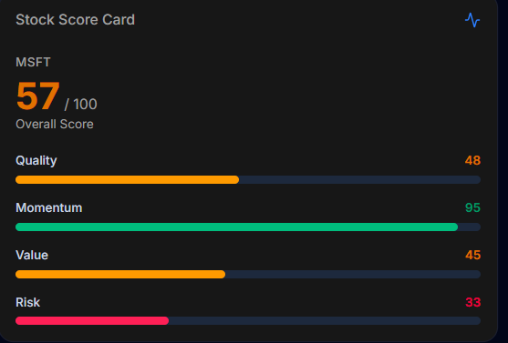
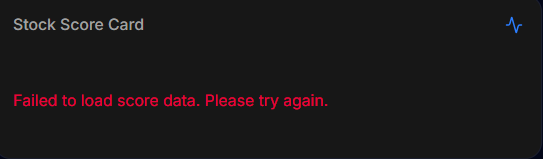

NEXUS-PORT- 010 – Stock Score Card

1. Thông tin
Họ tên: Mai Thị Thu Ngân
Nhóm: 3
Task: SV10 – Stock Score Card
Ngày thực hiện: 11/9/2026 (cập nhật lần cuối: 24/9/2026)

2. Chức năng này dùng để làm gì?
Chức năng này hiển thị một thẻ điểm tổng hợp (Score Card) cho một mã cổ phiếu, giúp người dùng đánh giá nhanh cổ phiếu đó mà không cần đọc báo cáo tài chính chi tiết. Thẻ gồm một Điểm Tổng (Overall Score, thang 0–100) và 4 điểm thành phần: Quality (chất lượng, đo lợi nhuận điều chỉnh theo rủi ro), Momentum (đà tăng giá), Value (giá trị, dùng lợi nhuận 1 năm làm chỉ số thay thế) và Risk (mức độ biến động/an toàn).

3. Nghiệp vụ
3.1 Người dùng muốn làm gì?
Người dùng đang xem một mã cổ phiếu và muốn biết nhanh cổ phiếu đó "tốt hay xấu" theo nhiều khía cạnh khác nhau, thay vì phải tự phân tích số liệu thô.
3.2 Tại sao Nexus cần chức năng này?
Chức năng này giúp người dùng ra quyết định đầu tư nhanh hơn, tổng hợp nhiều chỉ số phức tạp thành các con số dễ hiểu, hỗ trợ so sánh nhanh giữa các mã.
3.3 Người dùng sử dụng như thế nào?
Người dùng mở dashboard Thị Trường Cổ Phiếu Mỹ.
Hệ thống gọi API lấy điểm số cho mã đang được chọn.
Hiển thị Điểm Tổng và 4 điểm thành phần dưới dạng Score Card, mỗi điểm có màu theo mức: từ 70 trở lên màu xanh lá, từ 40 đến 69 màu vàng cam, dưới 40 màu đỏ.

4. API sử dụng
API: GET /api/v1/stocks/analysis?symbols={symbol}
Tham số symbols là bắt buộc, kiểu array<string>, truyền qua query string (ví dụ: ?symbols=AAPL). API trả về điểm tổng (score) đã tính sẵn, cùng dữ liệu thô gồm 3 nhóm:

performance — lợi nhuận (total_return_1y)
trend_indicators — RSI, SMA, MACD
risk_metrics — biến động, sụt giảm tối đa, Sharpe ratio, beta

Lưu ý quan trọng: API không trả sẵn 4 điểm Quality/Momentum/Value/Risk như ví dụ minh họa trong đề bài, và cũng không có dữ liệu định giá (P/E, P/B...) nên không thể tính điểm "Value" đúng nghĩa. Vì vậy tôi đã tự tính 4 điểm thành phần từ dữ liệu thô (công thức ở mục 7). Riêng Value chỉ là chỉ số thay thế tạm thời dựa trên lợi nhuận 1 năm, không phải Value chuẩn theo định giá doanh nghiệp.

5. Input
Ví dụ: mã cổ phiếu AAPL, MSFT

6. Output
Ví dụ (dữ liệu thật từ API):

AAPL
Overall Score: 43 / 100
Quality: 7272
Momentum: 16
Value: 81
Risk: 61

MSFT
Overall Score: 57 / 100
Quality: 48
Momentum: 95
Value: 45
Risk: 33

7. Cách tôi thực hiện

Tìm endpoint qua Swagger docs (http://127.0.0.1:8000/docs), dùng "Try it out" → "Execute" để xác nhận tham số bắt buộc (symbols) và cấu trúc JSON trả về thật, thay vì đoán theo mô tả đề bài.
Phát hiện API không có sẵn Quality/Momentum/Value/Risk, chỉ có score tổng và dữ liệu thô 3 nhóm (performance, trend_indicators, risk_metrics). Kiểm tra thêm 2 endpoint khác (/analytics/stock-summary, /data-pipeline/portfolio-inputs) để chắc chắn hệ thống không có dữ liệu định giá ở đâu khác.
Tự thiết kế công thức quy đổi dữ liệu thô sang thang điểm 0-100, giới hạn lại trong khoảng 0-100:
Quality = 50 + sharpe_ratio*20 (Sharpe thường dao động khoảng -2 đến 3, quy đổi quanh mốc 50).
Momentum = rsi_14 (đã ở thang 0-100), +10 nếu MACD đang bullish, -10 nếu không.
Value (chỉ số thay thế) = 50 + total_return_1y*100 (mốc 50 = hoà vốn). Không phải Value chuẩn vì API không có dữ liệu P/E, P/B.
Risk (điểm càng cao = càng an toàn) = 100 - annual_volatility*100 - |max_drawdown|*100.
Thiết kế component StockScoreCard.tsx nhận prop symbol, dùng apiClient (axios) và component Card sẵn có của project để đồng bộ với các component khác trong dashboard, thay vì viết fetch và UI tách biệt.
Gọi API trong useEffect, lưu kết quả vào state.
Xử lý 3 trạng thái: đang tải (loading), lỗi (error), có dữ liệu (data).
Hiển thị Điểm Tổng lớn, 4 điểm thành phần dạng thanh tiến trình. Thêm hàm getScoreColor để màu chữ và màu thanh luôn khớp nhau theo mức điểm.
Nhãn hiển thị trong Score Card dùng tiếng Anh (Stock Score Card, Overall Score, Quality, Momentum, Value, Risk), thông báo lỗi cũng bằng tiếng Anh.
Gắn component vào app/page.tsx, test với nhiều mã và các trường hợp lỗi.

8. Code chính
components/StockScoreCard.tsx — component chính
app/page.tsx — thêm import, gắn <StockScoreCard symbol="AAPL" /> vào dashboard

9. Test

STT	Test case	Expected	Actual	Result
1	Nhập AAPL	Hiển thị Score Card với điểm số	Hiện đúng: 43/100, Quality 72, Momentum 16, Value 81, Risk 61	PASS
2	Nhập MSFT	Hiển thị Score Card với điểm số	Hiện đúng: 57/100, Quality 48, Momentum 95, Value 45, Risk 33	PASS
3	Nhập mã không tồn tại (ABCD)	Hiển thị thông báo lỗi/không tìm thấy, không crash	API trả lỗi cho mã không hợp lệ, code chạy vào nhánh catch, hiện "Failed to load score data. Please try again." — không crash	PASS
4	Tắt backend (dừng uvicorn)	Hiển thị thông báo lỗi, không crash	Hiện đúng thông báo lỗi, không crash trang	PASS

10. Screenshot
Test 1 — Nhập AAPL: 
Test 2 — Nhập MSFT: 
Test 3 — Nhập mã không tồn tại (ABCD): 
Test 4 — Tắt backend: 

11. Khó khăn gặp phải

API không trả sẵn 4 điểm Quality/Momentum/Value/Risk như đề bài minh họa, phải tự thiết kế công thức quy đổi từ dữ liệu thô. Ở bản đầu tôi bỏ chỉ số "Value" vì không có dữ liệu định giá. Ở bản cập nhật, tôi bổ sung lại Quality (từ Sharpe ratio) và Value (từ lợi nhuận 1 năm, ghi rõ là chỉ số thay thế) để đủ 4 điểm như đề bài.
Khi cập nhật, Quality và Value lúc đầu chỉ hiện thanh màu mà không hiện số.Khởi động lại npm run dev và tải lại trang thì số hiện đúng.
Khi test với mã không tồn tại, ban đầu dự kiến API sẽ trả về 200 với danh sách rỗng nên đã viết riêng nhánh xử lý "không tìm thấy dữ liệu". Thực tế API trả về lỗi cho mã không hợp lệ, nên nhánh đó không được kích hoạt — nhánh catch xử lý chung đã đảm nhiệm việc này. Kết quả vẫn đúng yêu cầu (không crash, có thông báo) nhưng cho thấy cần kiểm tra kỹ hành vi thật của API thay vì chỉ giả định.
Khi tắt backend để test, sau khi bật lại server và bấm nút "Làm mới dữ liệu" trên trang, Score Card vẫn còn kẹt ở trạng thái lỗi cũ. Lý do là component chỉ gọi API một lần trong useEffect lúc mount, còn nút "Làm mới dữ liệu" của trang chỉ gọi lại API cho bảng danh sách cổ phiếu, không liên quan đến Score Card. Phải tải lại (F5) toàn bộ trang thì Score Card mới gọi lại API — đây là điểm có thể cải thiện thêm (thêm cơ chế retry riêng) nếu có thời gian.

12. Tôi đã học được gì?

Cách đọc và test API qua Swagger UI (Try it out / Execute) để xác nhận đúng endpoint, tham số bắt buộc và cấu trúc dữ liệu trả về, thay vì đoán theo mô tả đề bài.
Không phải lúc nào API thật cũng khớp với ví dụ minh họa trong đề bài — cần biết linh hoạt điều chỉnh thiết kế và giải thích rõ lý do thay vì cố làm cho đúng ví dụ.
Cách xử lý 3 trạng thái loading / error / data trong React với useState + useEffect, đảm bảo giao diện không "trắng trang" hay crash dù API lỗi hoặc server tắt.
Hiểu rõ hơn sự khác biệt giữa việc component tự fetch dữ liệu một lần với việc có cơ chế làm mới/retry riêng — giới hạn cần lưu ý khi thiết kế các component tương tự sau này.
Cách tổ chức component cho khớp với style và cách gọi API sẵn có của dự án (dùng apiClient, component Card có sẵn) thay vì viết code tách biệt, giúp codebase nhất quán hơn.
Khi giao diện không khớp với code, cần kiểm tra đúng file và đúng thư mục đang chạy, rồi khởi động lại server để nạp code mới.

13. Git
Branch: feature/NEXUS-PORT-010-stock-score-card
Commit: feat: add stock score card; [điền thêm commit của lần sửa này, ví dụ: fix: correct Quality and Value scores in StockScoreCard]
Merge Request: https://github.com/NicolasWillyam/nexus-fe/pull/12
